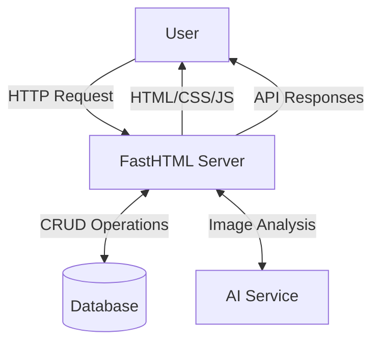

# Food Diary App Architecture

## Core Architecture Decision: Single-Server Approach

We will use a **single FastHTML server** to handle both frontend HTML rendering and backend API endpoints. This decision aligns with our principles of simplicity, performance, and maintainability.

### Architecture Overview

### Key Components

- **FastHTML Server**: Single server handling both HTML rendering and JSON API endpoints
- **Database**: Stores user data, food diary entries, and metadata
- **AI Service**: Processes food images to identify content and portion sizes
- **Frontend**: Server-rendered HTML with FastTags, enhanced by HTMX

### Justification for Single-Server Approach

1. **Simplicity**
   - Single codebase to maintain
   - Single deployment to manage
   - Unified authentication and session management
   - Streamlined development workflow

2. **Performance**
   - Eliminates network latency between frontend and backend
   - Server-rendered HTML is fast to load and parse
   - HTMX provides SPA-like interactivity without full client-side rendering

3. **Maintainability**
   - Easier to trace request flow through application
   - Fewer moving parts to understand and debug
   - Simpler mental model for developers

4. **Practical Considerations**
   - FastHTML is performant and designed specifically for server-rendered HTML applications
   - Server-side rendering works well for content-focused applications
   - HTMX is built into FastHTML for partial page updates without heavy client frameworks

### Tradeoffs

While we gain simplicity with this approach, we acknowledge certain tradeoffs:

1. Less clear separation of concerns between frontend and backend
2. Potential scaling challenges if frontend and backend have different load patterns
3. Less flexibility to switch frontend technologies independently

For our current requirements and scale, the benefits of the single-server approach outweigh these considerations.

## Next Steps

- Define database schema and ORM approach
- Design API endpoints for food diary operations
- Create FastHTML templates and HTMX interactions
- Plan AI integration for food image processing

## Frontend Interaction Pattern: Static Shell with HTMX Swapping

To leverage the efficiency of HTMX and provide a smooth user experience, we will follow a "static shell" pattern for page rendering and navigation:

1.  **Initial Page Load:** The first request to any primary URL (e.g., `/`, `/login`) will return the *full HTML document* rendered using the `BaseLayout` component. This includes the `<html>`, `<head>`, `<body>`, the static `Navbar` (and potentially `Footer`/`Sidebar` components later), and the initial content for the `<main>` area.

2.  **HTMX Navigation:** Subsequent navigation triggered by user actions (e.g., clicking links in the `Navbar`) will use HTMX attributes (`hx-get`, `hx-post`, etc.). These requests will specifically target the main content area of the page (e.g., `<main id="main-content">`).

3.  **Fragment Responses:** The server-side route handlers responding to these HTMX requests will return **only the HTML fragment** needed to update the main content area. They will *not* render the full `BaseLayout` again.

4.  **DOM Update:** HTMX will receive this fragment and swap it into the designated target element (e.g., `#main-content`), leaving the static shell (Navbar, etc.) untouched in the browser's DOM.

**Rationale:**

*   **Efficiency:** Minimizes data transfer by sending only changed content.
*   **Performance:** Reduces browser rendering workload, leading to faster perceived page loads.
*   **Maintainability:** Separates the static layout from dynamic page content logic.

This approach ensures that consistent elements like the navigation bar remain visually static while the central content updates dynamically. 