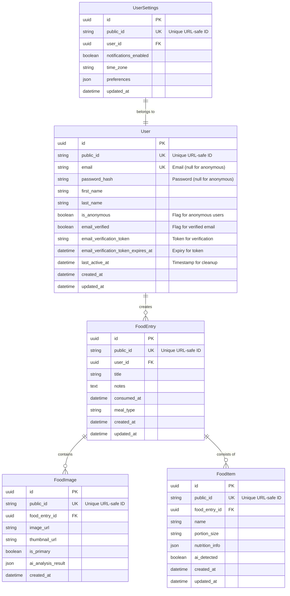

# Database Schema

This document outlines the data model for the Food Diary App.

## Entity Relationship Diagram



## Tables Description

### User

Stores user account information (registered and anonymous).

| Column | Type | Description |
|--------|------|-------------|
| id | UUID | Primary key (UUIDv7, stored as binary) |
| public_id | VARCHAR(13) | Unique, URL-safe identifier derived from id |
| email | VARCHAR(255) NULL | Unique email address (NULL for anonymous users) |
| password_hash | VARCHAR(255) NULL | Hashed password (NULL for anonymous users) |
| first_name | VARCHAR(100) NULL | User's first name (NULL for anonymous) |
| last_name | VARCHAR(100) NULL | User's last name (NULL for anonymous) |
| is_anonymous | BOOLEAN | True if the user has not registered, default False |
| email_verified | BOOLEAN | True if the user's email is verified, default False |
| email_verification_token | VARCHAR(255) NULL | Unique token sent for email verification |
| email_verification_token_expires_at | TIMESTAMP NULL | Expiry time for the verification token |
| last_active_at | TIMESTAMP | Timestamp of the last user activity |
| created_at | TIMESTAMP | Account creation time |
| updated_at | TIMESTAMP | Last update time |

### FoodEntry

Represents a single food diary entry, typically a meal.

| Column | Type | Description |
|--------|------|-------------|
| id | UUID | Primary key (UUIDv7, stored as binary) |
| public_id | VARCHAR(13) | Unique, URL-safe identifier derived from id |
| user_id | UUID | Foreign key to User |
| title | VARCHAR(255) | Entry title (e.g., "Breakfast") |
| notes | TEXT | User notes about the meal |
| consumed_at | TIMESTAMP | When the food was consumed |
| meal_type | VARCHAR(50) | Type of meal (breakfast, lunch, dinner, snack) |
| created_at | TIMESTAMP | Entry creation time |
| updated_at | TIMESTAMP | Last update time |

### FoodImage

Stores images associated with food entries.

| Column | Type | Description |
|--------|------|-------------|
| id | UUID | Primary key (UUIDv7, stored as binary) |
| public_id | VARCHAR(13) | Unique, URL-safe identifier derived from id |
| food_entry_id | UUID | Foreign key to FoodEntry |
| image_url | VARCHAR(255) | URL to stored image |
| thumbnail_url | VARCHAR(255) | URL to thumbnail version |
| is_primary | BOOLEAN | Whether this is the main image |
| ai_analysis_result | JSONB | Raw AI analysis results |
| created_at | TIMESTAMP | Image upload time |

### FoodItem

Individual food items within a food entry.

| Column | Type | Description |
|--------|------|-------------|
| id | UUID | Primary key (UUIDv7, stored as binary) |
| public_id | VARCHAR(13) | Unique, URL-safe identifier derived from id |
| food_entry_id | UUID | Foreign key to FoodEntry |
| name | VARCHAR(255) | Food item name |
| portion_size | VARCHAR(100) | Portion size description |
| nutrition_info | JSONB | Optional nutritional information |
| ai_detected | BOOLEAN | Whether AI identified this item |
| created_at | TIMESTAMP | Item creation time |
| updated_at | TIMESTAMP | Last update time |

### UserSettings

User preferences and settings.

| Column | Type | Description |
|--------|------|-------------|
| id | UUID | Primary key (UUIDv7, stored as binary) |
| public_id | VARCHAR(13) | Unique, URL-safe identifier derived from id |
| user_id | UUID | Foreign key to User (Unique one-to-one) |
| notifications_enabled | BOOLEAN | Whether notifications are enabled |
| time_zone | VARCHAR(50) | User's preferred time zone |
| preferences | JSONB | Miscellaneous user preferences |
| updated_at | TIMESTAMP | Last update time |

## Indices

| Table | Index Name | Columns | Type | Purpose |
|-------|------------|---------|------|---------|
| User | user_public_id_idx | public_id | UNIQUE | Fast lookup by public ID |
| User | user_email_idx | email | UNIQUE | Fast lookup by registered user email (handles NULLs) |
| User | user_anon_cleanup_idx | is_anonymous, last_active_at | BTREE | Efficiently find anonymous users for cleanup |
| User | user_email_verification_token_idx | email_verification_token | UNIQUE | Fast lookup by verification token |
| FoodEntry | food_entry_public_id_idx | public_id | UNIQUE | Fast lookup by public ID |
| FoodEntry | food_entry_user_id_idx | user_id | BTREE | Fast lookup of user's entries |
| FoodEntry | food_entry_consumed_at_idx | consumed_at | BTREE | Chronological sorting/filtering |
| FoodImage | food_image_public_id_idx | public_id | UNIQUE | Fast lookup by public ID |
| FoodImage | food_image_entry_id_idx | food_entry_id | BTREE | Fast lookup of entry's images |
| FoodItem | food_item_public_id_idx | public_id | UNIQUE | Fast lookup by public ID |
| FoodItem | food_item_entry_id_idx | food_entry_id | BTREE | Fast lookup of entry's food items |
| UserSettings | user_settings_public_id_idx | public_id | UNIQUE | Fast lookup by public ID |
| UserSettings | user_settings_user_id_idx | user_id | UNIQUE | Enforce one-to-one relationship |

## Future Schema Extensions (V2/V3)

For reference, these tables will be added in future versions:

### HealthEvent (V2)

```
id UUID PK
user_id UUID FK
event_type VARCHAR(100)
description TEXT
severity INT
started_at TIMESTAMP
ended_at TIMESTAMP
created_at TIMESTAMP
```

### FoodCorrelation (V2)

```
id UUID PK
user_id UUID FK
food_item_id UUID FK
health_event_id UUID FK
correlation_strength FLOAT
first_observed_at TIMESTAMP
last_observed_at TIMESTAMP
```

### NutritionGoal (V3)

```
id UUID PK
user_id UUID FK
nutrient_type VARCHAR(100)
target_amount FLOAT
unit VARCHAR(50)
created_at TIMESTAMP
updated_at TIMESTAMP
``` 