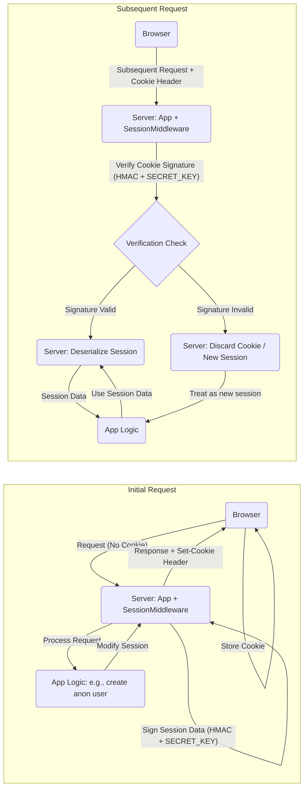
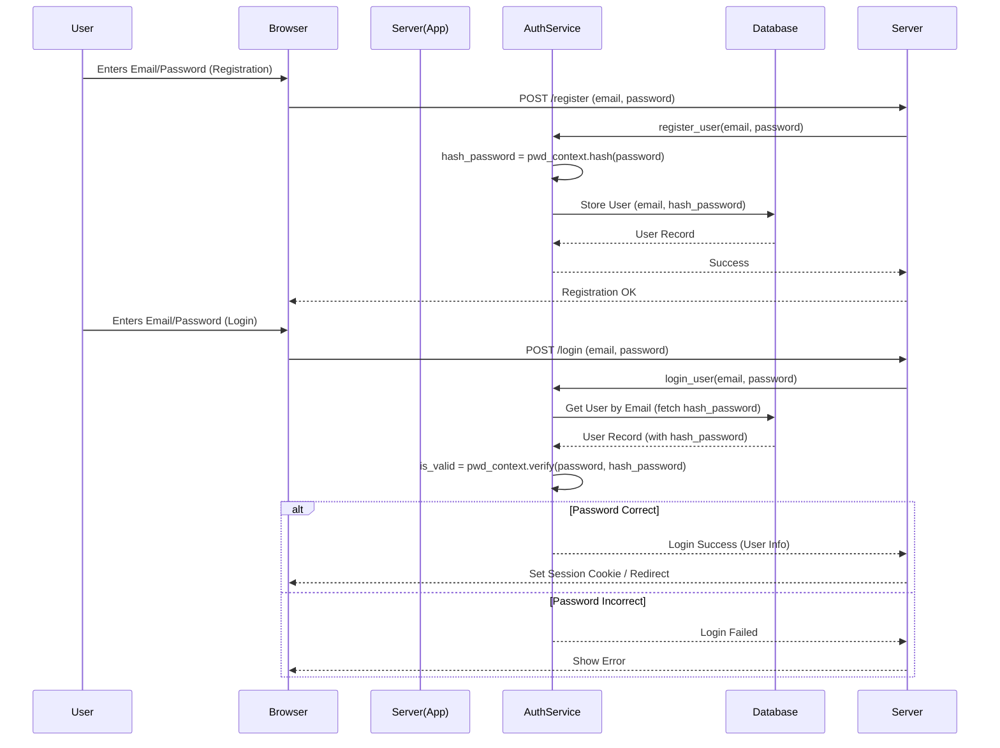

# Encryption and Security Design

This document outlines the security practices for the Food Diary App, focusing on secret key management, session cookie security, and password hashing.

## 1. Secret Key Management

### Purpose
A strong, unpredictable secret key is essential for cryptographically signing session cookies and potentially other security tokens. This prevents attackers from forging session data or guessing security tokens.

### Generation
- **Method:** Use a cryptographically secure random number generator.
- **Python Example:**
  ```python
  import secrets
  secrets.token_hex(32) # Generates a 64-character hex string (32 bytes)
  ```
- **Length:** Aim for at least 32 bytes (256 bits) of entropy.

### Storage
- **NEVER** commit secret keys directly into source code (Git).
- **Local Development:** Store the `SECRET_KEY` in the `.env` file (which is listed in `.gitignore`).
- **Production/Staging:** Store the `SECRET_KEY` as an environment variable provided securely to the application container/server (e.g., via Docker secrets, cloud provider secret management services, or environment variable injection).

### Rotation
- For high-security environments, periodic key rotation is recommended. This is out of scope for the initial phase of this project but should be considered for production systems.

## 2. Session Cookie Security

### Mechanism
We rely on Starlette's `SessionMiddleware`, configured within FastHTML. This middleware handles the creation, signing, and verification of session cookies.

### Signing and Verification
- **Process:** When session data is modified, `SessionMiddleware` serializes it, signs it using HMAC with the application's `SECRET_KEY`, and encodes it (often Base64).
- **Integrity:** On subsequent requests, the middleware extracts the cookie, re-computes the signature using the `SECRET_KEY`, and compares it to the signature attached to the cookie data. If they don't match, the cookie is considered tampered with and rejected.
- **Confidentiality:** Note that standard session cookies are signed for integrity but **not encrypted** by default. The *content* of the session cookie is typically base64 encoded but readable if intercepted (unless HTTPS is used).

### Cookie Attributes
`SessionMiddleware` sets security-enhancing attributes on the `Set-Cookie` header:
- **`HttpOnly`:** (Default: True) Prevents client-side JavaScript from accessing the cookie, mitigating XSS attacks that try to steal session cookies.
- **`Secure`:** (Default: True if `https=True` in middleware config, recommended True for production) Ensures the cookie is only sent over HTTPS connections, preventing interception over insecure HTTP.
- **`SameSite`:** (Default: 'lax') Protects against Cross-Site Request Forgery (CSRF) attacks by controlling when the cookie is sent with cross-origin requests. 'Lax' is a good default; 'Strict' can be used for higher security if compatibility allows.
- **`Path`:** (Default: '/') Scope of the cookie.
- **`Max-Age` / `Expires`:** Controls cookie persistence.

### Diagram: Session Cookie Flow



## 3. Password Management (for Email/Password Auth)

### Hashing Requirement
- **NEVER** store passwords in plaintext or using reversible encryption.
- **ALWAYS** use a strong, adaptive, salted password hashing algorithm.

### Algorithm Choice
- **Recommendation:** Use `passlib`, a robust Python library for password hashing.
- **Primary Choice:** Argon2 (modern, winner of the Password Hashing Competition). It's computationally intensive and resistant to GPU cracking attempts.
- **Alternative:** bcrypt (older but still widely trusted and strong).
- **Avoid:** MD5, SHA1, SHA256 (these are fast hashing algorithms designed for checksums, not password security, and are vulnerable to brute-force/rainbow table attacks).

### Implementation with `passlib`
1.  **Install:** `pip install passlib[argon2]` or `pip install passlib[bcrypt]`
2.  **Configuration:** Set up a `PasswordContext` in `app/services/auth.py` or a dedicated utility module.
    ```python
    from passlib.context import CryptContext

    # Configure context: Use Argon2, fallback to bcrypt if needed (optional)
    # Automatically handles salt generation
    pwd_context = CryptContext(schemes=["argon2", "bcrypt"], deprecated="auto")
    ```
3.  **Hashing:** When a user registers or changes their password:
    ```python
    hashed_password = pwd_context.hash(plain_password)
    # Store hashed_password in the database
    ```
4.  **Verification:** When a user logs in:
    ```python
    is_valid = pwd_context.verify(submitted_plain_password, stored_hashed_password)
    ```
    `passlib` automatically extracts the salt and algorithm parameters from the stored hash string to perform the verification.

### Diagram: Password Handling Flow



## 4. Additional Considerations

- **HTTPS:** Enforce HTTPS in production to encrypt all traffic, protecting session cookies and other sensitive data in transit.
- **Input Validation:** Use Pydantic or similar libraries to rigorously validate all incoming data to prevent injection attacks and other vulnerabilities.
- **Rate Limiting:** Implement rate limiting on authentication endpoints (login, registration, password reset) to mitigate brute-force attacks. 