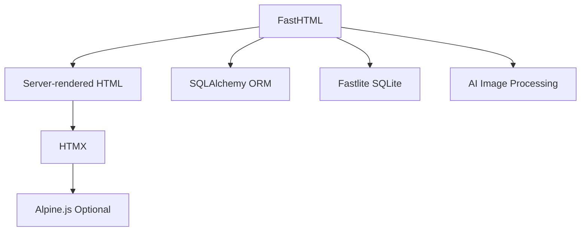

# Technology Stack

This document outlines the technology choices for the Food Diary App.

## Core Technologies



### Backend

| Technology | Purpose | Justification |
|------------|---------|---------------|
| **Python** | Programming language | Simplicity, extensive libraries, AI integration capabilities |
| **FastHTML** | Web framework | Server-rendered HTML, simplicity, performance, Starlette-based |
| **SQLAlchemy** or **Fastlite** | ORM/Database | Mature ORM for more complex needs, or simple Fastlite for lighter requirements |
| **Alembic** | Database migrations | Works well with SQLAlchemy, handles schema evolution |
| **PostgreSQL** or **SQLite** | Database | Choose based on scaling needs (PostgreSQL for production, SQLite for development) |
| **pytest** | Testing | Comprehensive testing framework |

### Frontend

| Technology | Purpose | Justification |
|------------|---------|---------------|
| **FastHTML Templates** | HTML generation | Built-in templating with FastTags for clean HTML generation from Python |
| **HTMX** | Dynamic interactions | Minimal JavaScript, server-driven UI updates, included in FastHTML by default |
| **Alpine.js** (optional) | Client-side interactivity | Lightweight alternative to heavy frameworks when needed |
| **Pico CSS** | Styling | Lightweight CSS framework with FastHTML integration or use Tailwind CSS |
| **Web Components** (optional) | Reusable UI elements | Native browser support, no build step required, compatible with FastHTML |

### Image Processing & AI

| Technology | Purpose | Justification |
|------------|---------|---------------|
| **OpenAI API** or **Google Vision API** | Food recognition | Powerful pre-trained models, simple API integration |
| **Pillow** | Image manipulation | Python standard for image processing |
| **Cloudinary** or **S3** | Image storage | Managed service for image hosting, transformations |

### DevOps & Infrastructure

| Technology | Purpose | Justification |
|------------|---------|---------------|
| **Docker** | Containerization | Consistent environments, simplified deployment |
| **GitHub Actions** | CI/CD | Automated testing, deployment pipelines |
| **Poetry** or **Pip** | Dependency management | Consistent package versions |
| **Uvicorn** | ASGI server | High-performance server (integrated with FastHTML's serve() utility) |

## Dependencies

### Python Package Dependencies

```
# Web Framework
python-fasthtml>=0.2.0
uvicorn[standard]>=0.22.0  # Included with FastHTML
python-multipart>=0.0.6  # For form/file uploads

# Database
sqlalchemy>=2.0.0  # Optional if using Fastlite
alembic>=1.11.0  # Optional if using Fastlite
psycopg2-binary>=2.9.6  # Optional - PostgreSQL driver

# Authentication & Security
passlib>=1.7.4
python-jose>=3.3.0
bcrypt>=4.0.1

# Image Processing
pillow>=10.0.0
python-magic>=0.4.27  # For file type detection

# AI Integration
openai>=0.27.0  # For OpenAI API
google-cloud-vision>=3.4.0  # Option for Google Vision API

# Storage
boto3>=1.26.0  # For S3 integration
python-cloudinary>=1.33.0  # Option for Cloudinary

# Testing
pytest>=7.3.1
pytest-asyncio>=0.21.0
httpx>=0.24.0  # For async HTTP client in tests
```

### Frontend Dependencies

Most frontend dependencies are managed by FastHTML. PicoCSS is included by default, but others can be added:

```html
<!-- For Alpine.js (optional) -->
<script src="https://unpkg.com/alpinejs@3.13.0/dist/cdn.min.js" defer></script>

<!-- For Tailwind (if preferred over PicoCSS) -->
<link href="https://cdn.jsdelivr.net/npm/tailwindcss@2.2.19/dist/tailwind.min.css" rel="stylesheet">
```

## Deployment Considerations

- **Development**: Local environment with FastHTML's built-in server
- **Testing**: GitHub Actions for CI/CD pipeline
- **Production**: 
  - Option 1: Cloud VPS (DigitalOcean, Linode)
  - Option 2: PaaS (Heroku, Fly.io, Render)
  - Option 3: Containerized service (AWS ECS, Google Cloud Run)

## Version Control Strategy

- **Repository**: GitHub
- **Branching Strategy**: Feature branches with pull requests
- **Release Strategy**: Semantic versioning (MAJOR.MINOR.PATCH) 