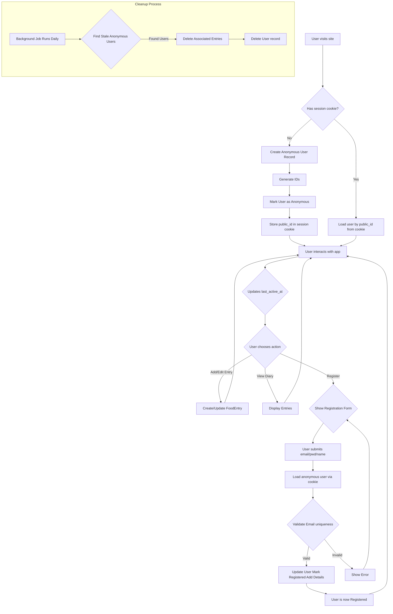

# Anonymous User and Registration Workflow

This document describes the process for handling users who start using the application without registering and how their data is transitioned upon registration.

## Goals

- Minimize initial user friction.
- Allow users to experience the core functionality before committing to registration.
- Persist anonymous user data within a browser session using cookies.
- Seamlessly transition anonymous user data to a registered account.
- Automatically clean up stale anonymous user data.

## Workflow Diagram

## Detailed Steps

1.  **New Visitor / Session Check:**
    *   When a user accesses the site, the application checks for a specific session cookie containing a `user.public_id`.
    *   **If cookie exists:** The application retrieves the corresponding `User` record from the database using the `public_id`. If found, the `last_active_at` timestamp is updated. This user is now the active user for the session.
    *   **If no cookie or user not found:** A new anonymous user record is created.

2.  **Anonymous User Creation:**
    *   Generate a new UUIDv7 for the `id` column.
    *   Derive the `public_id` (e.g., Base32 of first 8 bytes).
    *   Insert a new record into the `User` table with:
        *   `is_anonymous = True`
        *   `email`, `password_hash`, `first_name`, `last_name` set to `NULL`.
        *   `created_at` and `last_active_at` set to the current timestamp.
    *   Store the generated `public_id` in a persistent session cookie sent to the user's browser.
    *   This new user becomes the active user for the session.

3.  **User Interaction:**
    *   All actions performed by the user (creating/editing diary entries, viewing data) are associated with their current `user_id`.
    *   Every significant interaction should update the `last_active_at` timestamp on the `User` record.

4.  **Registration Process:**
    *   The user initiates the registration process (e.g., clicks a "Sign Up" button).
    *   A registration form is presented asking for email, password, name, etc.
    *   Upon submission, the application:
        *   Retrieves the current user's `public_id` from the session cookie.
        *   Loads the corresponding `User` record.
        *   Performs validation:
            *   Checks if the submitted email already exists for another *registered* user (`is_anonymous = False`). If so, display an error.
            *   Validates password strength, etc.
        *   If validation passes, updates the *existing* `User` record:
            *   Sets `is_anonymous = False`.
            *   Populates the `email`, `password_hash`, `first_name`, `last_name` fields.
            *   Updates `last_active_at`.
    *   The user is now considered registered. Their session continues, and all previously created data remains linked to their account.

5.  **Login:**
    *   Registered users log in using their email and password.
    *   Upon successful authentication, a session cookie containing their `public_id` is set, replacing any previous anonymous cookie.

6.  **Data Cleanup (Background Job):**
    *   A scheduled task (e.g., running daily) queries the database.
    *   It selects `User` records where `is_anonymous = True` AND `last_active_at` is older than a defined threshold (e.g., 7 days).
    *   For each identified user, the job deletes their associated records in other tables (`FoodEntry`, `FoodImage`, `FoodItem`, `UserSettings`) – preferably using database-level cascading deletes defined via foreign key constraints.
    *   Finally, the stale anonymous `User` record itself is deleted.

## Database Considerations

*   **Nullable Fields:** Ensure `email`, `password_hash`, `first_name`, `last_name` in the `User` table allow `NULL` values.
*   **Unique Email Constraint:** The unique constraint on the `email` column must correctly handle `NULL` values (most databases treat NULLs as distinct, allowing multiple anonymous users with `NULL` emails, which is desired).
*   **Indices:** An index on `(is_anonymous, last_active_at)` is crucial for the performance of the cleanup job.
*   **Cascading Deletes:** Define `ON DELETE CASCADE` for foreign key constraints pointing to `User.id` from other tables (`FoodEntry`, `UserSettings`) to simplify the cleanup process. 